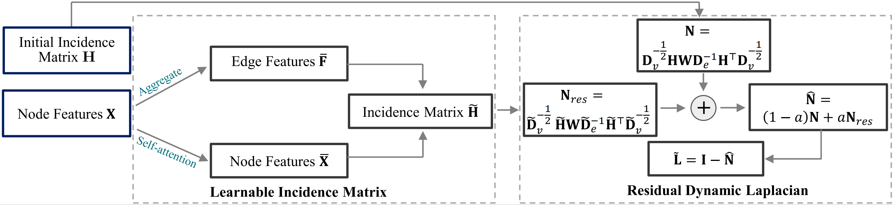

# HERALD
Source code of  ICASSP22 papaer:  [Learnable Hypergraph Laplacian for Hypergraph Learning](https://arxiv.org/pdf/2106.06666.pdf).
```
@inproceedings{zhang2022learnable,
  title={Learnable hypergraph laplacian for hypergraph learning},
  author={Zhang, Jiying and Chen, Yuzhao and Xiao, Xi and Lu, Runiu and Xia, Shu-Tao},
  booktitle={ICASSP 2022-2022 IEEE International Conference on Acoustics, Speech and Signal Processing (ICASSP)},
  pages={4503--4507},
  year={2022},
  organization={IEEE}
}
```


The HERALD module can be run by 
```
python herald.py
```